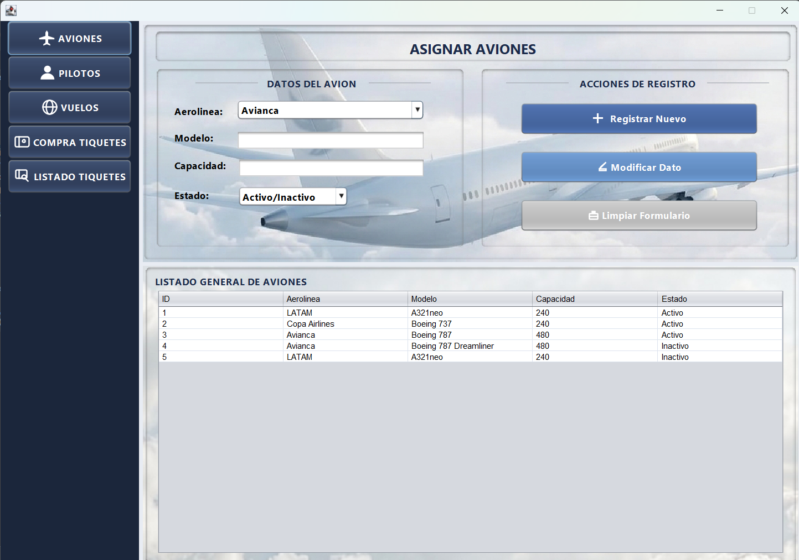
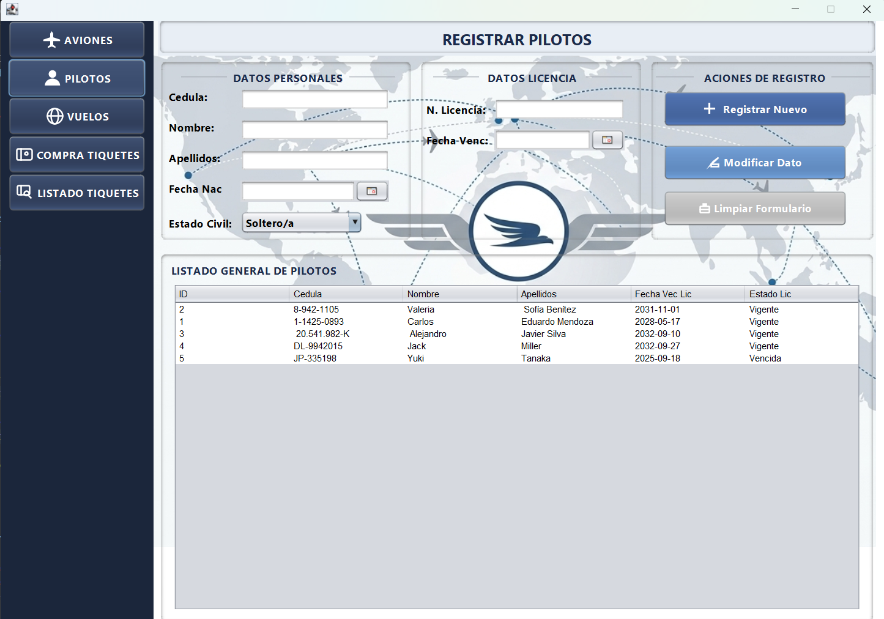
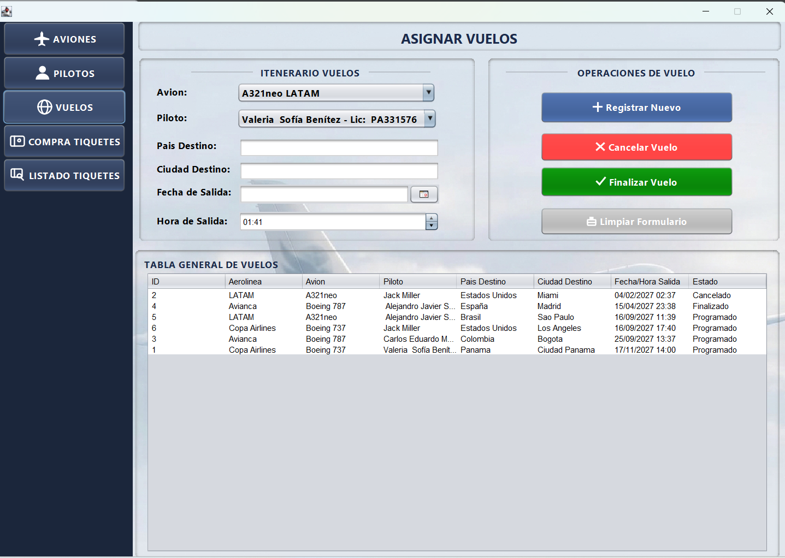
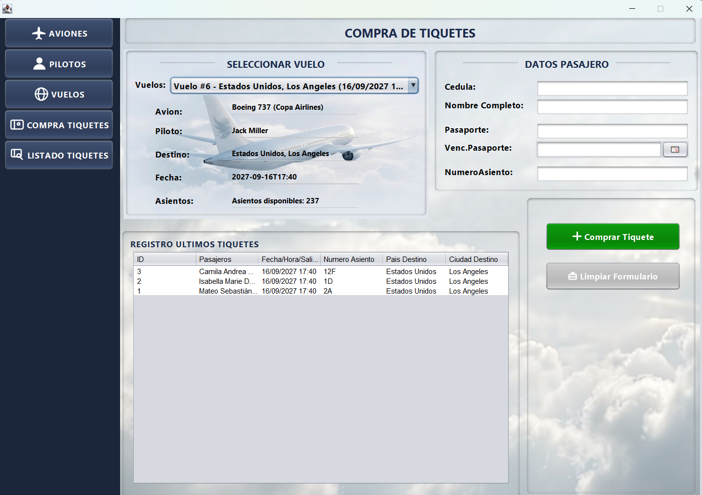
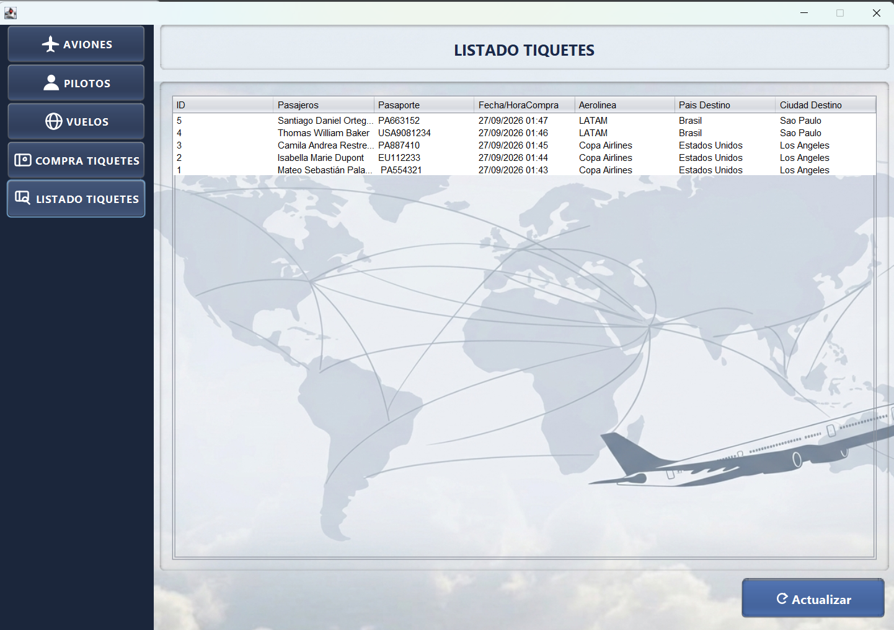
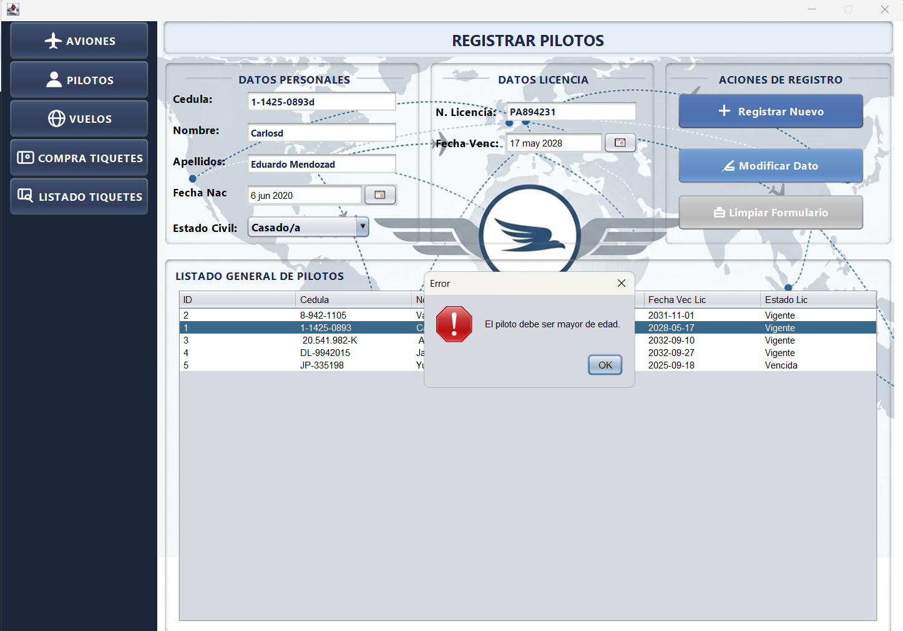

# Sistema de Gestión de Aerolíneas

Sistema de escritorio desarrollado en **Java** con **NetBeans**, que permite gestionar aviones, pilotos, vuelos y la venta de tiquetes de una aerolínea, aplicando **arquitectura en capas**, **buenas prácticas de base de datos**, validaciones de reglas de negocio y control de concurrencia con **Threads**.

> Proyecto desarrollado como parte de mi formación en Ingeniería en Sistemas (Programación III), con el objetivo de aplicar en un caso real los principios de diseño de software en capas, persistencia con JDBC/MySQL y control de versiones con Git.

---

## Capturas de pantalla

### Gestión de Aviones


### Gestión de Pilotos


### Gestión de Vuelos


### Compra de Tiquetes


### Listado de Tiquetes Vendidos


### Ejemplo de validación de reglas de negocio


---

## Funcionalidades

- **Gestión de Aviones**: registro, modificación y listado. Validación de capacidad mayor a 0 y campos obligatorios.
- **Gestión de Pilotos**: registro, modificación y listado. Validación de mayoría de edad y de licencia vigente.
- **Gestión de Vuelos**: registro con selección de avión (solo Activos) y piloto (solo licencia vigente). Cambio de estado a Cancelado/Finalizado. Validación de fecha de salida futura.
- **Compra de Tiquetes**: selección de vuelo con información dinámica en pantalla, reutilización automática de pasajeros existentes por cédula, validación de pasaporte vigente y control de disponibilidad de asientos.
- **Listado de Tiquetes Vendidos**: vista consolidada de todas las compras realizadas.
- **Navegación unificada** mediante un menú lateral con `CardLayout`, sin ventanas independientes sueltas.

---

## Arquitectura

El proyecto está organizado en **4 capas independientes**, siguiendo el principio de responsabilidad única:

```
┌─────────────────────────────────────────────┐
│                 INTERFAZ                     │
│   Pantallas Swing (JFrame/JPanel).           │
│   Captura datos del usuario y muestra        │
│   resultados. No contiene lógica de negocio. │
└───────────────────┬───────────────────────────┘
                     │
┌────────────────────▼──────────────────────────┐
│                  LÓGICA                        │
│   Reglas de negocio y validaciones.            │
│   Decide qué operaciones son válidas.          │
└────────────────────┬───────────────────────────┘
                     │
┌────────────────────▼──────────────────────────┐
│                   DATOS                        │
│   Acceso a MySQL vía JDBC (PreparedStatement). │
│   Un DAO por entidad. Sin lógica de negocio.   │
└────────────────────┬───────────────────────────┘
                     │
┌────────────────────▼──────────────────────────┐
│                  MODELO                        │
│   Clases POJO que representan las entidades    │
│   del sistema (Avion, Piloto, Vuelo, etc.)     │
└─────────────────────────────────────────────────┘
```

**¿Por qué en capas?** Cada capa tiene una única responsabilidad y no conoce los detalles internos de las demás. Esto permite, por ejemplo, que la capa de Datos nunca inserte información inválida en la base de datos porque la capa de Lógica ya filtró esos casos antes — y aun así, la base de datos mantiene sus propias restricciones (`CHECK`, `UNIQUE`, `FOREIGN KEY`) como una segunda barrera de protección (defensa en profundidad).

---

## Tecnologías utilizadas

- **Java** (Swing para la interfaz gráfica)
- **MySQL** (persistencia de datos)
- **JDBC** (MySQL Connector/J) con `PreparedStatement` para prevenir inyección SQL
- **NetBeans IDE**
- **JCalendar** (componente `JDateChooser` para selección de fechas)
- **Git** para control de versiones

---

## Características técnicas destacadas

- **Control de concurrencia con Threads**: la compra de tiquetes usa un método `synchronized` para evitar condiciones de carrera cuando dos operaciones intentan vender el mismo asiento simultáneamente, reforzado además con una restricción `UNIQUE` a nivel de base de datos.
- **Validaciones de negocio en capa Lógica**, independientes de la interfaz: mayoría de edad de pilotos, vigencia de licencias, vigencia de pasaportes, disponibilidad de asientos, coherencia de fechas.
- **Credenciales fuera del código fuente**: la configuración de conexión a la base de datos se carga desde `config.properties` (ignorado por Git), nunca hardcodeada en el código Java.
- **Base de datos normalizada**: 6 tablas relacionadas con claves foráneas e integridad referencial (`ON DELETE RESTRICT` para evitar borrados que rompan el historial).
- **Navegación de un solo `JFrame`** con `CardLayout`, en vez de múltiples ventanas independientes.

---

## Modelo de base de datos

El sistema utiliza 6 tablas relacionadas:

- `aerolineas` — catálogo de aerolíneas
- `aviones` — aviones registrados, cada uno asociado a una aerolínea
- `pilotos` — pilotos registrados
- `vuelos` — vuelos, cada uno con un avión y un piloto asignado
- `pasajeros` — pasajeros que compran tiquetes
- `tiquetes` — cada compra, vinculada a un vuelo y un pasajero

El script completo de creación de la base de datos está disponible en [`database/script_bd.sql`](database/script_bd.sql).

---

## Cómo ejecutar el proyecto localmente

### Requisitos previos

- Java JDK 8 o superior
- MySQL Server (local o remoto)
- NetBeans IDE (recomendado, aunque el proyecto puede compilarse con cualquier IDE compatible con Ant)

### Pasos

1. **Clonar el repositorio**
   ```bash
   git clone https://github.com/TU_USUARIO/Sistema_Aerolineas.git
   cd Sistema_Aerolineas
   ```

2. **Crear la base de datos**

   Ejecuta el script incluido en `database/script_bd.sql` en tu cliente de MySQL:
   ```sql
   SOURCE database/script_bd.sql;
   ```

3. **Configurar la conexión a la base de datos**

   Copia el archivo de ejemplo y complétalo con tus propios datos:
   ```bash
   cp config.properties.example config.properties
   ```
   Edita `config.properties` con tu usuario y contraseña de MySQL:
   ```properties
   db.url=jdbc:mysql://localhost:3306/sistema_aerolineas
   db.user=tu_usuario
   db.password=tu_contrasena
   ```

4. **Abrir el proyecto en NetBeans**

   Abre la carpeta del proyecto desde NetBeans (`File → Open Project`).

5. **Ejecutar**

   Corre el proyecto (`Run → Run Project`, o F6). La aplicación abre en la clase `interfaz.FrmPrincipal`.

---

## Estructura del proyecto

```
Sistema_Aerolineas/
├── src/
│   ├── modelo/       # Clases POJO (Avion, Piloto, Vuelo, Pasajero, Ticket, Aerolinea)
│   ├── datos/        # Conexión JDBC y DAOs
│   ├── logica/        # Validaciones y reglas de negocio
│   ├── interfaz/      # Pantallas Swing (JFrame/JPanel)
│   ├── iconos/         # Generador de íconos para la interfaz
│   └── imagenes/       # Recursos gráficos (fondos, etc.)
├── database/
│   └── script_bd.sql   # Script de creación de la base de datos
├── screenshots/         # Capturas de pantalla para este README
├── config.properties.example
└── README.md
```

---

## Posibles mejoras futuras

- Migrar la conexión JDBC a un pool de conexiones (ej. HikariCP) para mejor rendimiento con múltiples usuarios concurrentes.
- Agregar reportes exportables (PDF/Excel) del listado de tiquetes vendidos.
- Implementar autenticación de usuarios con roles (administrador / agente de ventas).

---

## Autor

Cristofer Soto Vargas
[GitHub](https://github.com/chrissoto03) 

Proyecto desarrollado con fines educativos y de portafolio.
